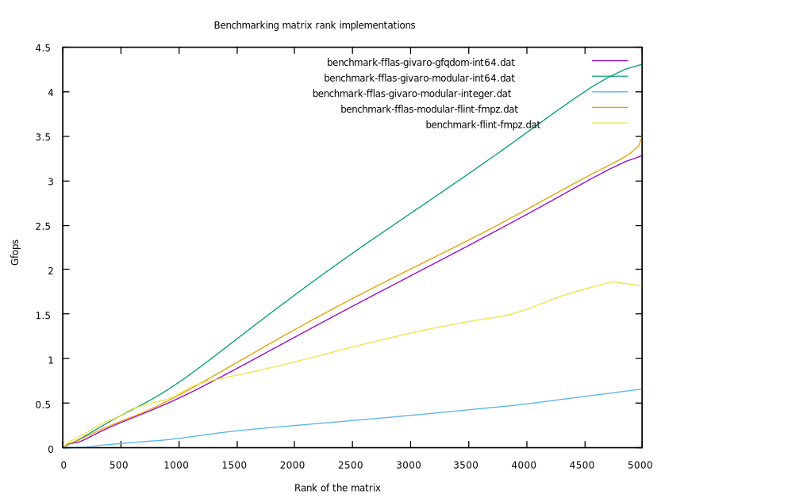

### Benchmarks

The plot below compares the speed of computing rank of a full rank NxN random matrix over ZZ/32003 using the following implementations:
- `FFPACK::PLUQ` using Givaro's `QFqDom<int64_t>`
- `FFPACK::PLUQ` using Givaro's `Modular<int64_t>`
- `FFPACK::PLUQ` using Givaro's `Modular<Integer>`
- `FFPACK::PLUQ` using `ModularFlint<fmpz>` (see [`modular-flint.h`](../modular-flint.h))
- `fq_nmod_mat_rank` using FLINT's `fmpz` (makes a copy of the matrix)

by comparing the number of field operations per second (so higher is better).

